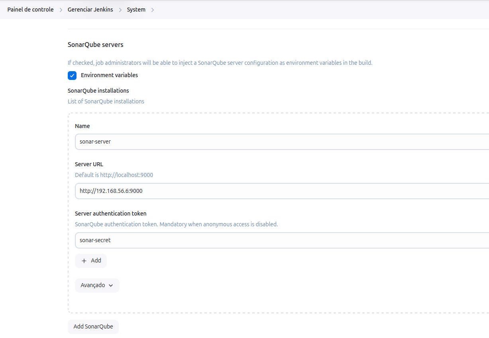
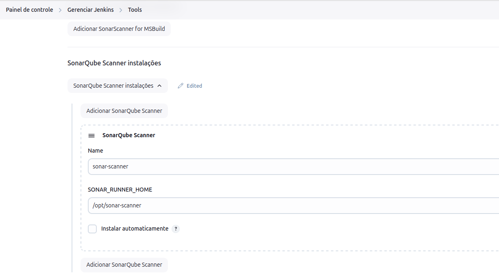

ps aux | grep java

sudo tail -n 50 /var/log/jenkins/jenkins.log

journalctl -u jenkins.service --since "10 minutes ago"

tail -f /var/log/jenkins/jenkins.log

sudo cat /var/lib/jenkins/secrets/initialAdminPassword

sudo usermod -aG docker jenkins

sudo passwd jenkins

sudo systemctl restart jenkins

Dentro do Jenkins
Baixar os plugins SonarQube Scanner e Pipeline: Stage View

docker run -d -p 8091:8081 -p 8123:8123 --name nexus -v nexus-data:/nexus-data sonatype/nexus3

cat /nexus-data/admin.password 

cd /var/lib/jenkins/workspace/projeto

docker build -t  devops/app .

docker login localhost:8123

docker tag devops/app:latest localhost:8123/devops/app

docker push localhost:8123/devops/app

curl -LO "https://dl.k8s.io/$(curl -L -s https://dl.k8s.io/release/stable.txt)/bin/linux/amd64/kubectl"

sudo install -o root -g root -m 0755 kubectl /usr/local/bin/kubectl

usermod -s /bin/bash jenkins

su -s jenkins

criar pasta ~/.kube/config e dentro dela colar o cat /etc/rancher/k3s/k3s.yaml do cluster k8s